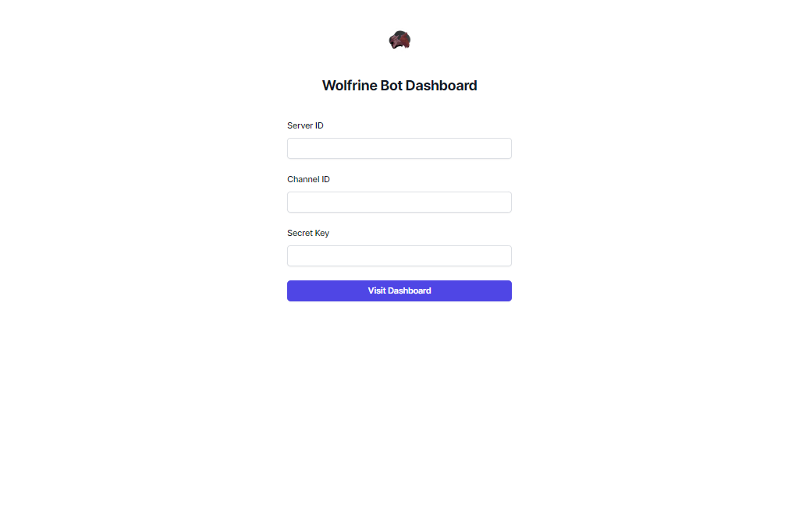

# Discord bot project is based on slash commands
        Main components-
            1. Dashboard (monitoring)
            2. Bot server (hosting)

## NOTE
        Every command is a slash command.

### Moderator Commands (SECRET KEY)
#### IN DISCORD APP 
    1. Register Event
    2. Register Task
    3. Get all registered users
    4. Get all event completed users
    4. Close Event

#### IN DASHBOARD
    1. Monitor Event
    2. Monitor/Edit/Delete Task
    3. Get all registered users
    4. Get all event completed users
    5. View Submissions of users

### User Commands 
#### IN DISCORD APP
    1. Register for event
    2. Submit daily task and post url

# DASHBOARD

$ To access dashboard one must have secret key

## All Events

## All Tasks

## Registered Users

## Completed Users

## All Users Tasks

